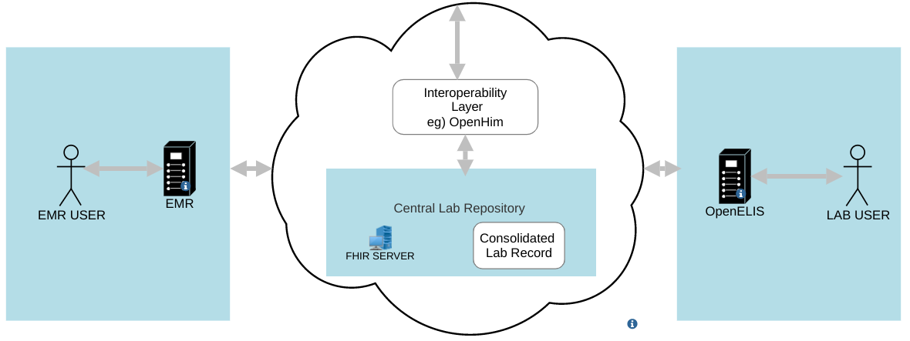

# Home - OpenELIS Global FHIR Implementation Guide v0.2.0

## Home

### About this guide

This Implementation Guide (IG) describes the HL7® FHIR® R4 interfaces of [OpenELIS Global](https://openelis-global.org), the open-source laboratory information system maintained by the Digital Initiatives Group (DIGI) at the University of Washington and the OpenELIS Global community.

It is written for teams connecting another system to OpenELIS: EMRs such as OpenMRS, national shared health records and lab data repositories, facility and client registries, other OpenELIS laboratories, and analyzer middleware.

**What the profiles describe.** Every profile, extension and identifier system in this guide describes what OpenELIS Global 3.x reads and writes today. They were checked against the [OpenELIS-Global-2](https://github.com/DIGI-UW/OpenELIS-Global-2) `develop` branch at commit `889166b` (29 September 2026). Where OpenELIS does something that is not ideal FHIR, the guide documents the current behaviour and lists the gap on the [Known Issues](known-issues.md) page. It does not describe the behaviour we would like instead.

### Where to find the rest of the documentation

This guide covers the FHIR contract only. Installation, configuration and user documentation live in the OpenELIS Global documentation space on Confluence:

* [FHIR Implementation Guide](https://uwdigi.atlassian.net/wiki/spaces/oeg/pages/1683488769/FHIR+Implementation+Guide): the Confluence landing page for this guide
* [OpenELIS Global documentation home](https://uwdigi.atlassian.net/wiki/spaces/oeg/overview)
* [Interoperability Roadmap](https://uwdigi.atlassian.net/wiki/spaces/oeg/pages/645136385/Interoperability+Roadmap): systems OpenELIS has been tested with
* [OpenMRS Interoperability](https://uwdigi.atlassian.net/wiki/spaces/oeg/pages/239992838/Medical+Records+System+OpenMRS+Interoperability): configuring OpenMRS and OpenELIS for FHIR lab orders and results
* [Interacting with the co-resident FHIR store](https://uwdigi.atlassian.net/wiki/spaces/oeg/pages/246382619/Interacting+with+Co-resident+FHIR+Store)
* [Examples of FHIR messages used](https://uwdigi.atlassian.net/wiki/spaces/oeg/pages/240386061/Examples+of+FHIR+messages+used) between referring and reference labs

### How OpenELIS uses FHIR

OpenELIS has three FHIR surfaces. Most integration problems come from mixing them up.

| | | |
| :--- | :--- | :--- |
| **OpenELIS FHIR REST API** | A FHIR R4 server inside OpenELIS, at`https://{host}/api/OpenELIS-Global/fhir`. It reads and writes the OpenELIS database directly. | Querying and managing patients, orders, specimens, results, organizations, practitioners, storage locations and analyzers. See[OpenELIS FHIR REST API](api.md). |
| **Co-resident FHIR store** | A HAPI FHIR JPA server deployed next to every OpenELIS instance (`org.openelisglobal.fhirstore.uri`). OpenELIS writes transaction bundles to it after order entry, result entry and validation. | The copy of OpenELIS data that other systems subscribe to, and the store other OpenELIS instances poll for referrals and shipments. |
| **Remote FHIR servers** | Servers OpenELIS polls (`org.openelisglobal.remote.source.uri`) and pushes to (`org.openelisglobal.fhir.subscriber`). | Receiving lab orders from EMRs, lab-to-lab referral, specimen shipment, and pushing data to a shared health record or lab data repository. See[Exchange Workflows](workflows.md). |

**Typical deployment: an EMR and OpenELIS exchange orders and results through a shared FHIR server, optionally behind an interoperability layer such as OpenHIM.**

### Profiles in this guide

| | | | |
| :--- | :--- | :--- | :--- |
| People and places | [OpenELIS Patient](StructureDefinition-openelis-patient.md) | Patient | Produced |
|   | [OpenELIS Practitioner](StructureDefinition-openelis-practitioner.md) | Practitioner | Produced |
|   | [OpenELIS Organization](StructureDefinition-openelis-organization.md) | Organization | Produced and consumed |
| Incoming orders | [Lab Order Request Task](StructureDefinition-openelis-lab-order-request-task.md) | Task | Consumed (from EMRs) |
|   | [Lab Order Request ServiceRequest](StructureDefinition-openelis-lab-order-request-service-request.md) | ServiceRequest | Consumed (from EMRs) |
| Orders | [OpenELIS Order Task](StructureDefinition-openelis-order-task.md) | Task | Produced |
|   | [OpenELIS ServiceRequest](StructureDefinition-openelis-service-request.md) | ServiceRequest | Produced |
|   | [OpenELIS Specimen](StructureDefinition-openelis-specimen.md) | Specimen | Produced |
|   | [OpenELIS Referral Task](StructureDefinition-openelis-referral-task.md) | Task | Produced and consumed (lab to lab) |
| Results | [OpenELIS Observation](StructureDefinition-openelis-observation.md) | Observation | Produced |
|   | [OpenELIS DiagnosticReport](StructureDefinition-openelis-diagnostic-report.md) | DiagnosticReport | Produced |
| Instruments | [OpenELIS Analyzer Device](StructureDefinition-openelis-analyzer-device.md) | Device | Produced and consumed |
| Storage | [OpenELIS Storage Location](StructureDefinition-openelis-storage-location.md) | Location | Produced and consumed |
| Shipment | [OpenELIS Shipment Box](StructureDefinition-openelis-shipment-box.md) | SupplyDelivery | Produced and consumed (lab to lab) |

The [CapabilityStatement](CapabilityStatement-OpenELISFhirServer.md) describes the REST API. The [Identifiers, Code Systems and URLs](identifiers.md) page lists every identifier system, local code system and extension URL OpenELIS uses. The [Artifacts](artifacts.md) page lists everything, including the worked examples.

### Conventions

* **Identifier and code system base.** OpenELIS builds most identifier systems and local code systems as `{base}/{suffix}`, where `{base}` is the `org.openelisglobal.oe.fhir.system` property. It defaults to `http://openelis-global.org`. The profiles in this guide assume the default. A site that changes the property sends different system URLs, and those will not match the slices in these profiles.
* **Must Support.** An element flagged Must Support is one OpenELIS populates whenever it holds the data. Receivers should store or display it. On incoming profiles, Must Support marks elements OpenELIS reads.
* **Resource ids** are the OpenELIS FHIR UUIDs of the underlying records. A ServiceRequest and the DiagnosticReport for the same test share one id, the Analysis UUID.
* **Environmental and vector samples** have no patient. Resources for them omit `subject` / `for`.
* **Mappings.** Each profile has a mapping to the OpenELIS data model (the `Mappings` tab), naming the table or class each element comes from.

### Contributing

The source is at [DIGI-UW/openelis-global2-fhir-ig](https://github.com/DIGI-UW/openelis-global2-fhir-ig), written in FHIR Shorthand. Pull requests are built by the HL7 IG Publisher in CI, and merges to `main` publish to this site. When OpenELIS changes what it sends, update the matching profile in the same release. Report problems as GitHub issues or in the OpenELIS Global community channels.

### Intellectual property

This guide and its examples may use terminologies such as LOINC® and SNOMED CT®, which have their own licence terms. Implementers are responsible for complying with them.

### Status

This is a **draft** (0.2.0, continuous integration build). It documents the behaviour of the current development branch and may change with each OpenELIS release.

